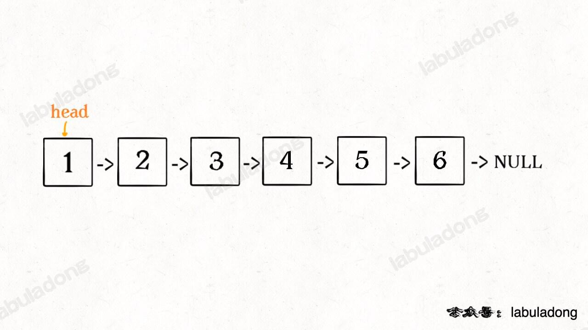
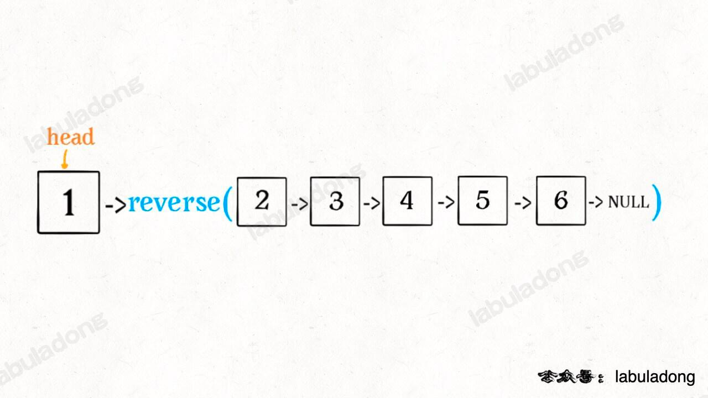

## Trapping Rain Water

对于柱子下标$i$, 下雨后能接的水等于:

1. 先将左右两边柱子高度最大值的最小值减去柱子$i$的高度. 
2. 结果为非负则返回.
3. 如果结果为负, 说明$i$比两边所有柱子都高, 因此$i$也接不了雨水, 结果为0.

即:
$$
W[i] = \lfloor \min \{ \max(H[0..i- 1]), \max H[i+ 1..n])\} - H[i] \rfloor
$$


```java
water_bar_array[i] = min_between_lmax_and_rmax > height[i] ? min_between_lmax_and_rmax - height[i] : 0;
```


我们可以使用dp, 计算柱子$i$的左右两边柱子高度的最大值的最小值.

可以使用双指针来进一步提高速度:

[Trapping Rain Water](https://leetcode.com/problems/trapping-rain-water/submissions/912486410/)的[双指针解法](https://labuladong.github.io/algo/di-san-zha-24031/jing-dian--a94a0/ru-he-gao--0d5eb/):

用两个指针`l_max` 和 `r_max` 代表`height[0..left]` 和 `height[right..end]` 的最高柱子高度.

则有:

```java
int trap(int[] height) {
    int left = 0, right = height.length - 1;
    int l_max = 0, r_max = 0;

    int res = 0;
    while (left < right) {
        l_max = Math.max(l_max, height[left]);
        r_max = Math.max(r_max, height[right]);

        // res += min(l_max, r_max) - height[i]
        if (l_max < r_max) {
            res += l_max - height[left];
            left++;
        } else {
            res += r_max - height[right];
            right--;
        }
    }
    return res;
}

```


假设left.leftmax < right.rightmax, 那么双指针算法就是要对left赋值, 也就相当于令i = left.


我们看到, i的leftmax就是left的leftmax, 但i的rightmax却未必就是right的rightmax, 因为left和right之间还有可能有更高的柱子j.


但这不重要了, 因为即使有更高的柱子H[j] > right.rightmax, 我们其实只关心 min( i.leftmax, i. rightmax), 

而right.rightmax是i右侧的某个值, 

在已知

i.leftmax < right.rightmax, 即i.leftmax <i右侧的某个值之后, i.leftmax是必定小于i.rightmax的.


因此只需要取i.leftmax.

> 此时的 `l_max` 是 `left` 指针左边的最高柱子，但是 `r_max` 并不一定是 `left` 指针右边最高的柱子，这真的可以得到正确答案吗？
>
> 其实这个问题要这么思考，我们只在乎 `min(l_max, r_max)`。**对于上图的情况，我们已经知道 `l_max < r_max` 了，至于这个 `r_max` 是不是右边最大的，不重要。重要的是 `height[i]` 能够装的水只和较低的 `l_max` 之差有关**

## nSum
nSum 问题就是给你输入一个数组 nums 和一个目标和 target，让你从 nums 选择 n 个数，使得这些数字之和为 target

对于nSum类题目， 可以用递归来解决， 使用twoSum作为basecase。

对于twoSum而言，使用排序+双指针就可以解决。 每次迭代时查看`nums[left] + nums[right]`和`target`是否相等， false则移动指针
##  Remove Nth Node From End of List
https://leetcode.com/problems/remove-nth-node-from-end-of-list/description/

注意， 题目给的N是按照最小距离为1来算的， 也就是说末尾节点距离其自身的距离为n=1。
为了方便， 我们还是按自己的约定， 即最小距离为0， 末尾节点距离其自身的距离为k=0。

使用快慢指针， 快指针比慢指针先走k步， 因此快指针到达end node时， 慢指针就离end node相差k步。
在单向链表中， 为了删除倒数第k个节点， 我们要找到倒数第k+1个节点。

在具体实现中， 为了避免空指针的情况， 我们会创建一个dummy节点，这是linked list中常见的做法。
```java
        //创建一个dummy节点, 使其作为新的head节点, 这是为了避免空指针.
        //考虑不使用dummy节点的情况:
        //假设linked list = [1], k = 0 (n=1). 我们要删除倒数第0个节点, 则要找到倒数第1个节点, 即findKthNodeFromEnd(head, 1)
        //fast指针会先走1步, 使得fast == null, 接着会进行while(fast.next != null)的判断, 但此时fast == null, 没有next方法, 因此会抛出空指针异常
        //采用dummy后, 我们调用的是findKthNodeFromEnd(dummy, 1). 按照上述步骤, fast先走1步, 使得fast == head(原来的head节点), 接着进行判断时就不会产生空指针异常

        ListNode dummy = new ListNode(0, head );
```


## Reverse Linked List
我们规定链表节点的索引从 1 开始

### Reverse the Whole Linked List


```java
// 输入一个节点 head, 将「以 head 为起点」的链表反转, 并返回反转之后的头结点.
ListNode reverse(ListNode head) {
    if (head == null || head.next == null) {
        return head;
    }
    ListNode last = reverse(head.next);
    head.next.next = head;
    head.next = null; //当链表递归反转之后，新的头结点是 last，而之前的 head 变成了最后一个节点，别忘了链表的末尾要指向 null：
    return last;
}
```

比如说我们想反转这个链表：


那么输入 reverse(head) 后，会在这里进行递归：
```java
ListNode last = reverse(head.next);
```
根据刚才的函数定义, 这段代码会产生：


这个 reverse(head.next) 执行完成后，整个链表就成了这样：


并且根据函数定义，reverse 函数会返回反转之后的头结点，我们用变量 last 接收了。

现在再来看下面的代码：
```java
head.next.next = head;
```

接下来：
```java
head.next = null;
return last;
```

### 反转链表前 N 个节点
这次我们实现一个这样的函数：
```java
// 将链表的前 n 个节点反转（n <= 链表长度）
ListNode reverseN(ListNode head, int n)
比如说对于下图链表，执行 reverseN(head, 3)：
```

解决思路和反转整个链表差不多，只要稍加修改即可：
```java
ListNode successor = null; // 后驱节点

// 反转以 head 为起点的 n 个节点，返回新的头结点
ListNode reverseN(ListNode head, int n) {
if (n == 1) {
// 记录第 n + 1 个节点
successor = head.next;
return head;
}
// 以 head.next 为起点，需要反转前 n - 1 个节点
ListNode last = reverseN(head.next, n - 1);

    head.next.next = head;
    // 让反转之后的 head 节点和后面的节点连起来
    head.next = successor;
    return last;
}
```

具体的区别：

1、base case 变为 n == 1，反转一个元素，就是它本身，同时要记录后驱节点。

2、刚才我们直接把 head.next 设置为 null，因为整个链表反转后原来的 head 变成了整个链表的最后一个节点。但现在 head 节点在递归反转之后不一定是最后一个节点了，所以要记录后驱 successor（第 n + 1 个节点），反转之后将 head 连接上。

### 反转链表的一部分

给一个索引区间 [m, n]（索引从 1 开始），仅仅反转区间中的链表元素。
```java
ListNode reverseBetween(ListNode head, int m, int n)

```
首先，如果 m == 1，就相当于反转链表开头的 n 个元素嘛，也就是我们刚才实现的功能：
```java
ListNode reverseBetween(ListNode head, int m, int n) {
// base case
if (m == 1) {
// 相当于反转前 n 个元素
return reverseN(head, n);
}
// ...
}
```

如果 m != 1 , 我们就使用递归：

```java
ListNode reverseBetween(ListNode head, int m, int n) {
// base case
if (m == 1) {
return reverseN(head, n);
}
// 前进到反转的起点触发 base case
head.next = reverseBetween(head.next, m - 1, n - 1);
return head;
}
```

## Remove Element in List
* [Remove Element of given value in list](https://leetcode.com/problems/remove-element/description/)
* [Remove Duplicates from Sorted Array](https://leetcode.com/problems/remove-duplicates-from-sorted-array/)

这类题目的难点在于一般都要求O(1)的额外空间复杂度, 即不能使用额外的数据结构. 对于线性序列的查重, 可以用快慢指针来解决. 
# Pattern Matching
The act of checking a given sequence of **tokens** (text) for the presence of the constituents of some
**pattern**.

* Def:
    * Pattern of length: $M$
    * Text of length: $N$

## Brute Force


```java
// 暴力匹配（伪码）
int search(String pat, String txt) {
    int M = pat.length;
    int N = txt.length;
    for (int i = 0; i <= N - M; i++) {
        int j;
        for (j = 0; j < M; j++) {
            if (pat[j] != txt[i+j])
                break;
        }
        // pat 全都匹配了
        if (j == M) return i;
    }
    // txt 中不存在 pat 子串
    return -1;
}
```


* Worst Case:

  > Text = XXXXXXXXXXXXXXXXXXXXXXXXXXXXXXXXXXXXXXXXY
  > Pattern = XXXXY

* Complexity:

    *  空间复杂度: $O(1)$ (不需要额外的空间)

    * 时间复杂度:  $O(MN)$

## KMP Algorithm

Knuth-Morris-Pratt Algorithm

https://people.cs.pitt.edu/~aus/cs1501/KMP_algorithm.pdf


* Takes advantage of the information about already matched characters to reduce the number of comparisons. 
* Avoids backing up in the text (only moves forward).


* To keep track of available shifts during each mismatched character we build a DFA (deterministic finite-state automata). 
  * DFA is constructed just **from the pattern** and before the execution.
* Complexity: 
  * 在我们的实现中, DFA是一个二维数组, 空间复杂度为 $O(256M) = O(M)$
  * 构建DFA(大小为$256M$)所需的时间复杂度是 $O(256M) = O(M)$. 而DFA构建好后, 进行模式匹配的时间仅仅为$O(N)$, 因为它不会回退text的指针`i`, 即只扫描一遍text

### DFA Construction

* DFA的状态数量和模式串pattern长度相等

* 在字符串匹配题目中, DFA接受的token都是ASCII字符, 总共不会超过 256 种

* 所以我们就构造数组`dfa[256][M]`来包含所有情况, 并且明确`dfa`数组的含义：

  > `next = dp[ch][j] `表示, 当前是状态`j`，遇到了字符`ch`，应该转移到状态`next`

* 注意到, KMP算法的DFA只与pattern有关, 与text无关

* ??? 下面这段没看懂, 为什么可以用这种方式构建影子状态`X`?

对于如何构建这个`dp`数组，需要一个辅助状态`X`，它永远比当前状态`j`落后一个状态，拥有和`j`最长的相同前缀，我们给它起了个名字叫「影子状态」。

在构建当前状态`j`的转移方向时，只有字符`pat[j]`才能使状态推进（`dp[j][pat[j]] = j+1`）；而对于其他字符只能进行状态回退，应该去请教影子状态`X`应该回退到哪里（`dp[j][other] = dp[X][other]`，其中`other`是除了`pat[j]`之外所有字符）。

对于影子状态`X`，我们把它初始化为 0，并且随着`j`的前进进行更新，更新的方式和 search 过程更新`j`的过程非常相似（`X = dp[X][pat[j]]`）。


1. 


